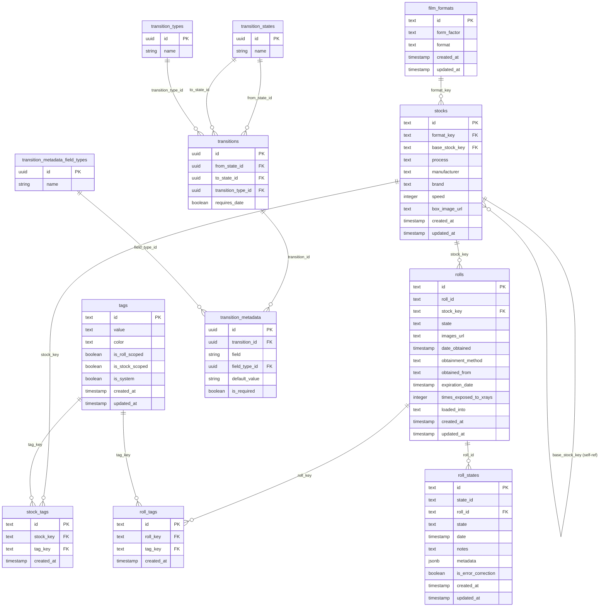

# Entity Relationship Diagram

The Frollz data model is organized around film rolls moving through a lifecycle. Rolls reference stocks, stocks reference film formats, and both can be tagged. The state machine that governs roll lifecycle transitions is defined entirely in the database.

## Notes

- `*_default` shadow tables mirror the main tables (`film_formats_default`, `stocks_default`, `tags_default`, `stock_tags_default`) and hold the seed data that is imported on startup. They are structurally identical to their main counterparts and are omitted from this diagram for clarity.
- `stocks.base_stock_key` is a self-referential foreign key used to link a rebranded or re-emulsioned stock back to its base formulation (e.g., a store-brand film back to its OEM stock).
- `roll_states.metadata` is a JSONB column holding state-specific data (temperatures, ISO, lab details, scan links, etc.) keyed by field name as defined in `transition_metadata`.
- The `transition_states` / `transitions` / `transition_metadata` tables define the DB-driven state machine — valid roll lifecycle transitions and their associated metadata fields are read from these tables at runtime.
